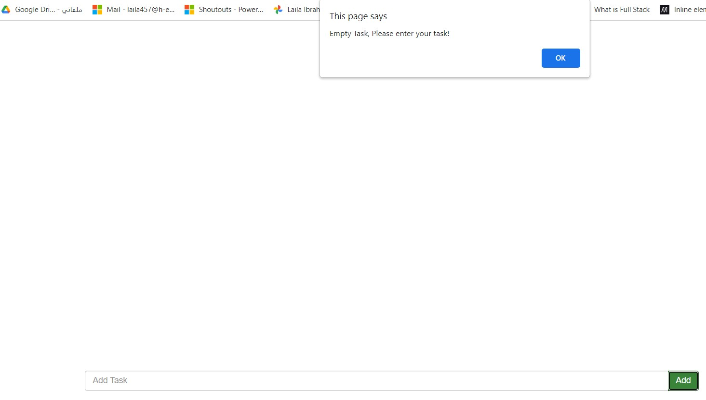
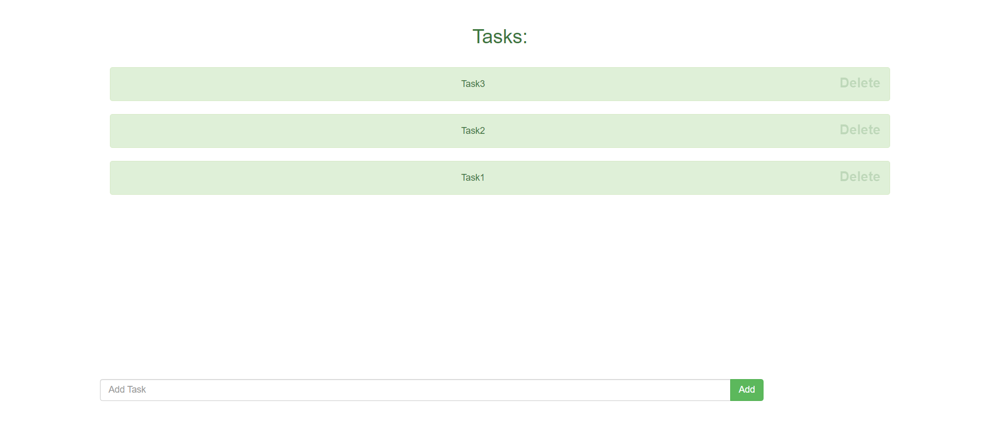
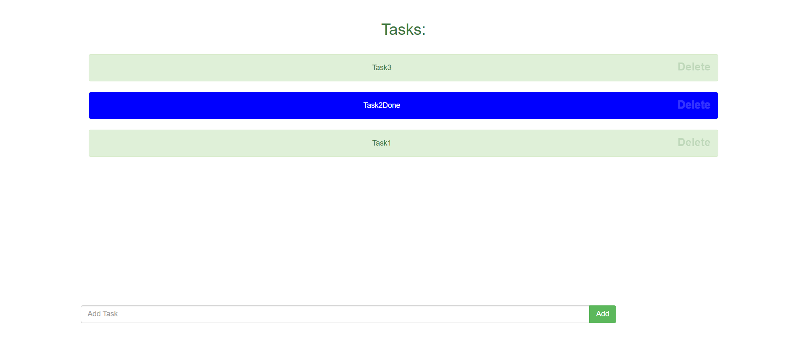
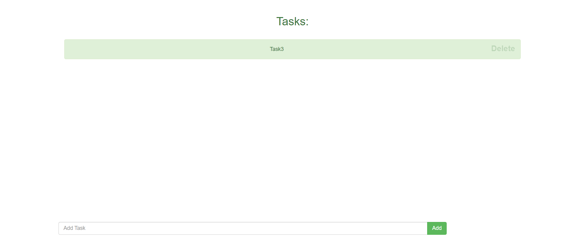

# Task 1 Using Jquery UI in Droppable and Draggable 
 > Solve:
 1. before drag image as in:
   

 2. After Drag image and hide it as in:
   

# Task 2 To Do List:
 > Solve:
 1. Try to enter Empty Task as in:
   
  
 2. Add 3 Tasks as in:
   
 
 3. click on task2 to make it Done:
   

 4. Delete Task 1 and Task2 as in:
   